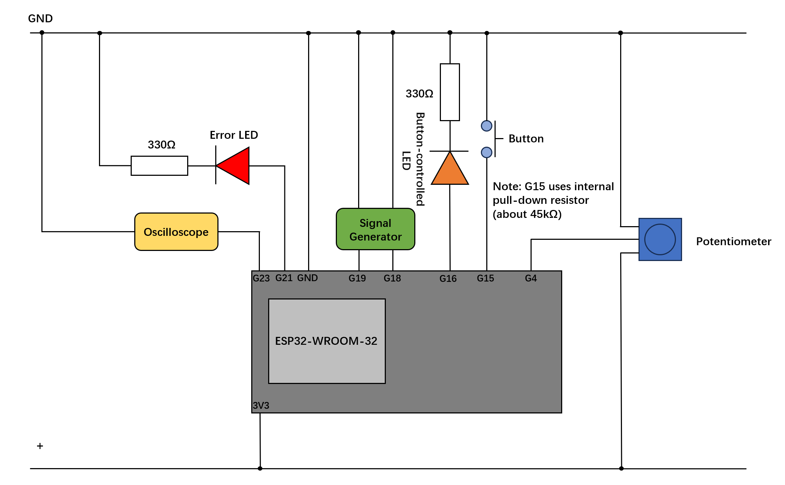

# B31DG-H00364903-Assignment2

This project is an implementation of a machine monitoring system using FreeRTOS and the ESP32 development kit. It involves multiple tasks that handle digital signal output, frequency measurement, analog input sampling, error detection, serial logging, button-controlled LED toggling, and CPU workload simulation.

## Features

- **Digital Signal Output**: Generates a precise sequence of high and low signals.
- **Frequency Measurement**: Measures the frequency of input signals using interrupts.
- **Analog Input Sampling**: Samples an analog input and computes a running average.
- **Error Detection**: Lights up an LED if the analog input exceeds a set threshold.
- **Serial Logging**: Logs frequency measurements to the serial port.
- **Button-controlled LED**: Toggles an LED state with a debounced button press.
- **CPU Workload Simulation**: Simulates CPU load by executing a no-operation loop.

### Prerequisites

- An ESP32 development board
- Arduino IDE (configured for ESP32)
- FreeRTOS (usually bundled with ESP32 support in Arduino IDE)
- An oscilloscope
- A signal generator

### Circuit Design Diagram

# Usage

Connect the circuit and configure the corresponding serial port, and once the firmware is uploaded to the ESP32, the system will start monitoring according to the configured tasks. Serial outputs can be viewed using the Arduino IDE's serial monitor set to 9600 bps.

# Contact

yh2013@hw.ac.uk

# Acknowledgements

FreeRTOS: https://www.freertos.org/zh-cn-cmn-s/
ESP32 Arduino: https://github.com/espressif/arduino-esp32
